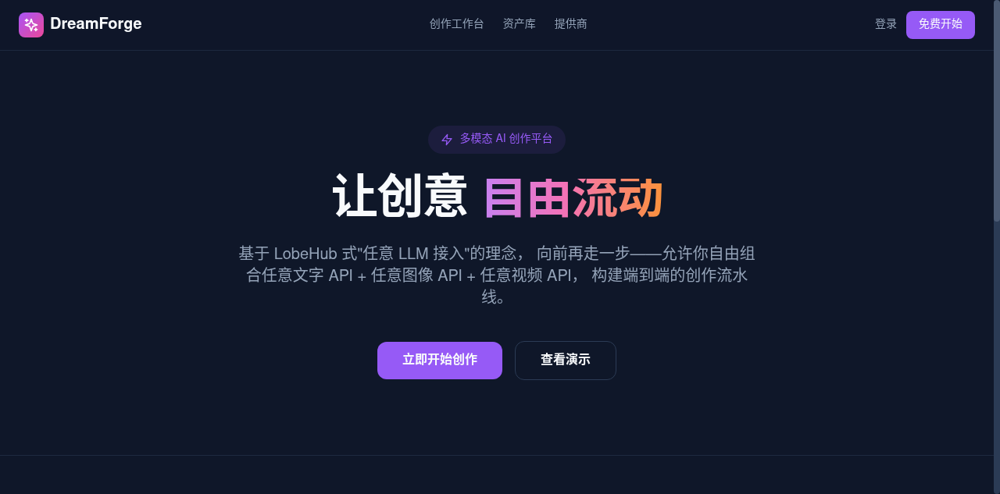
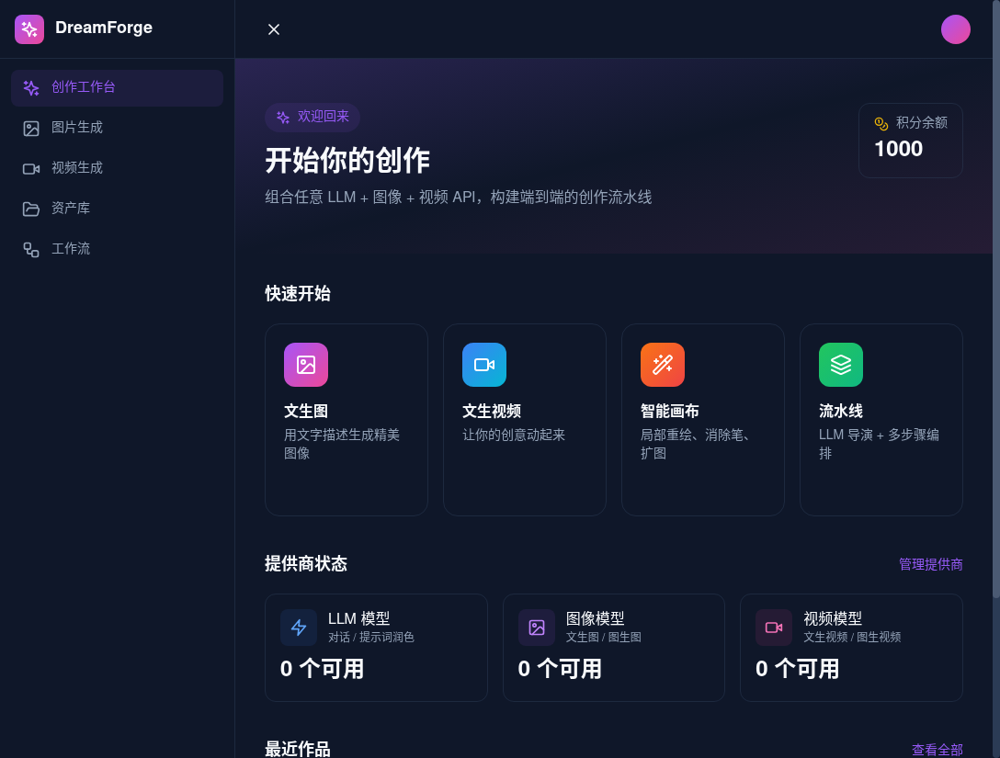
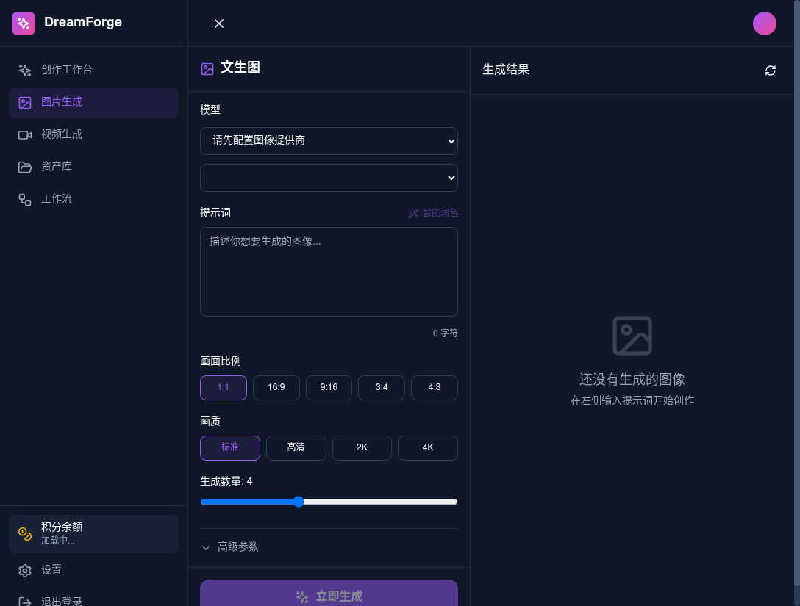
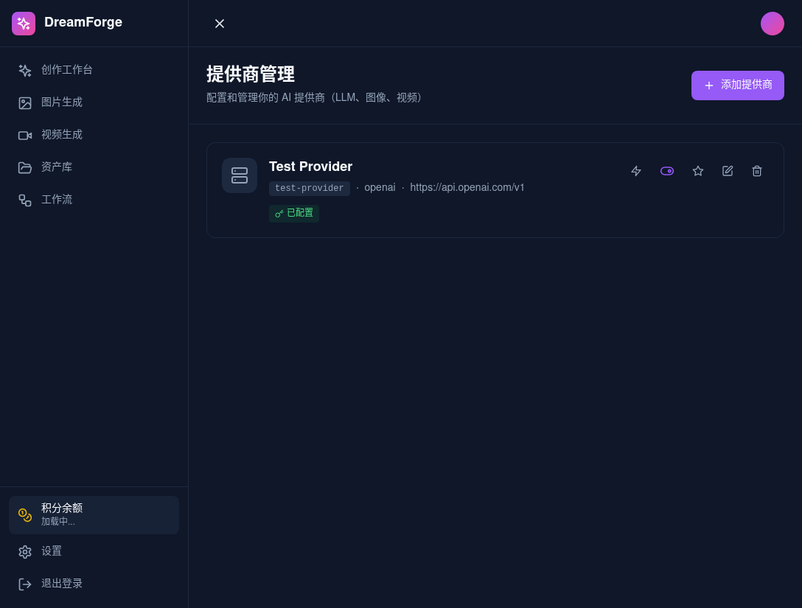

<div align="center">

<br/>

<a href="https://github.com/openforge-teams/multimodal-aI">
  
</a>

<br/>
<br/>

# **DreamForge**

> **多模态 AI 创作平台 · 让创意自由流动**

<p align="center">
  <a href="#features">
    <kbd>　核心特性　</kbd>
  </a>
  <a href="#tech-stack">
    <kbd>　技术架构　</kbd>
  </a>
  <a href="#quick-start">
    <kbd>　快速开始　</kbd>
  </a>
  <a href="#roadmap">
    <kbd>　路线图　</kbd>
  </a>
</p>

<br/>

<p align="center">
  <a href="https://github.com/openforge-teams/multimodal-aI/stargazers">
    
  </a>
  <a href="https://github.com/openforge-teams/multimodal-aI/issues">
    
  </a>
  <a href="https://github.com/openforge-teams/multimodal-aI">
    
  </a>
  <a href="./LICENSE">
    
  </a>
</p>

<br/>

</div>

---

<br/>

## ✦ 产品预览

<p align="center">
  
</p>

<p align="center"><sub>　<b>首页</b> · 品牌落地与核心价值传达　</sub></p>

<br/>

<p align="center">
  
</p>

<p align="center"><sub>　<b>创作工作台</b> · 统一入口，快速开始多模态创作　</sub></p>

<br/>

<p align="center">
  
</p>

<p align="center"><sub>　<b>文生图工作台</b> · 提示词润色、多参数控制、批量生成　</sub></p>

<br/>

<p align="center">
  
</p>

<p align="center"><sub>　<b>提供商管理</b> · 一键接入任意 LLM / 图像 / 视频 API　</sub></p>

<br/>

## ✦ 项目愿景

> 基于 **LobeHub** 式"任意 LLM 接入"的理念，向前再走一步 ——
> 允许用户自由组合 **任意文字 API + 任意图像 API + 任意视频 API**，
> 构建一套像即梦一样支持文生图、图生图、文生视频、图生视频、首尾帧、智能画布的 **端到端创作平台**。

<br/>

<h2 id="features">✦ 核心特性</h2>

<p align="center">
  <table align="center" style="border-collapse: collapse; margin: 0 auto;">
    <tr>
      <td align="center" width="200">
        <br/>
        <div align="center">
          
        </div>
        <br/>
        <b>任意 Provider 接入</b>
        <p align="center">
          <sub>
            任何兼容 OpenAI 协议的<br/>LLM、图像、视频 API 都能接入
          </sub>
        </p>
      </td>
      <td align="center" width="200">
        <br/>
        <div align="center">
          
        </div>
        <br/>
        <b>多模态创作</b>
        <p align="center">
          <sub>
            文生图 · 图生图<br/>文生视频 · 图生视频 · 首尾帧
          </sub>
        </p>
      </td>
      <td align="center" width="200">
        <br/>
        <div align="center">
          
        </div>
        <br/>
        <b>流水线编排</b>
        <p align="center">
          <sub>
            LLM 导演 + 图像 + 视频<br/>可视化节点串起创作流程
          </sub>
        </p>
      </td>
    </tr>
    <tr>
      <td align="center" width="200">
        <br/>
        <div align="center">
          
        </div>
        <br/>
        <b>智能画布</b>
        <p align="center">
          <sub>
            消除笔 · 局部重绘<br/>无损扩图 · 高清放大
          </sub>
        </p>
      </td>
      <td align="center" width="200">
        <br/>
        <div align="center">
          
        </div>
        <br/>
        <b>资产管理</b>
        <p align="center">
          <sub>
            版本谱系 · 可追溯<br/>可复现 · 可计费
          </sub>
        </p>
      </td>
      <td align="center" width="200">
        <br/>
        <div align="center">
          
        </div>
        <br/>
        <b>完全自托管</b>
        <p align="center">
          <sub>
            数据 · 模型 · 资产<br/>全部在你掌控中
          </sub>
        </p>
      </td>
    </tr>
  </table>
</p>

<br/>

<h2 id="tech-stack">✦ 技术架构</h2>

### 六层架构

<p align="center">
  <table align="center" style="border-collapse: collapse; width: 100%; max-width: 700px; font-family: -apple-system, BlinkMacSystemFont, 'Segoe UI', sans-serif;">
    <tr>
      <td style="border: 1px solid #e5e7eb; padding: 14px 20px; background: #fafafa; font-weight: 600; width: 180px; color: #6b7280;">Frontend Layer</td>
      <td style="border: 1px solid #e5e7eb; padding: 14px 20px; background: #fafafa;">Next.js RSC + SPA 混合 + Canvas 编辑器</td>
    </tr>
    <tr>
      <td style="border: 1px solid #e5e7eb; padding: 14px 20px; background: #f4f4f5; font-weight: 600; color: #6b7280;">API Gateway</td>
      <td style="border: 1px solid #e5e7eb; padding: 14px 20px; background: #f4f4f5;">RESTful（流式/文件）+ tRPC（业务）</td>
    </tr>
    <tr>
      <td style="border: 1px solid #e5e7eb; padding: 14px 20px; background: #fafafa; font-weight: 600; color: #6b7280;">Orchestration</td>
      <td style="border: 1px solid #e5e7eb; padding: 14px 20px; background: #fafafa;">创作流水线引擎 / 智能体编排</td>
    </tr>
    <tr>
      <td style="border: 1px solid #e5e7eb; padding: 14px 20px; background: #f4f4f5; font-weight: 600; color: #6b7280;">Multi-Provider<br/>Abstraction</td>
      <td style="border: 1px solid #e5e7eb; padding: 14px 20px; background: #f4f4f5;">LLM + Image + Video 统一适配层</td>
    </tr>
    <tr>
      <td style="border: 1px solid #e5e7eb; padding: 14px 20px; background: #fafafa; font-weight: 600; color: #6b7280;">Async Task<br/>Fabric</td>
      <td style="border: 1px solid #e5e7eb; padding: 14px 20px; background: #fafafa;">队列 + 状态机 + 轮询 / 回调 / Webhook</td>
    </tr>
    <tr>
      <td style="border: 1px solid #e5e7eb; padding: 14px 20px; background: #f4f4f5; font-weight: 600; color: #6b7280;">Infra &amp; Storage</td>
      <td style="border: 1px solid #e5e7eb; padding: 14px 20px; background: #f4f4f5;">PostgreSQL + Redis + S3 (MinIO/R2)</td>
    </tr>
  </table>
</p>

### 技术选型

<p align="center">
  <table align="center" style="border-collapse: collapse; width: 100%; max-width: 600px; margin: 0 auto;">
    <tr>
      <th style="border: 1px solid #e5e7eb; padding: 12px 18px; background: #f4f4f5; text-align: left; font-weight: 600; width: 120px;">层级</th>
      <th style="border: 1px solid #e5e7eb; padding: 12px 18px; background: #f4f4f5; text-align: left; font-weight: 600;">技术</th>
    </tr>
    <tr>
      <td style="border: 1px solid #e5e7eb; padding: 12px 18px; font-weight: 500;">前端</td>
      <td style="border: 1px solid #e5e7eb; padding: 12px 18px;">Next.js 14 (App Router) · React 18 · Tailwind CSS</td>
    </tr>
    <tr>
      <td style="border: 1px solid #e5e7eb; padding: 12px 18px; background: #fafafa; font-weight: 500;">状态管理</td>
      <td style="border: 1px solid #e5e7eb; padding: 12px 18px; background: #fafafa;">Zustand (slice 模式)</td>
    </tr>
    <tr>
      <td style="border: 1px solid #e5e7eb; padding: 12px 18px; font-weight: 500;">数据层</td>
      <td style="border: 1px solid #e5e7eb; padding: 12px 18px;">tRPC · SWR · Prisma</td>
    </tr>
    <tr>
      <td style="border: 1px solid #e5e7eb; padding: 12px 18px; background: #fafafa; font-weight: 500;">后端</td>
      <td style="border: 1px solid #e5e7eb; padding: 12px 18px; background: #fafafa;">Next.js Route Handlers · 独立 Worker</td>
    </tr>
    <tr>
      <td style="border: 1px solid #e5e7eb; padding: 12px 18px; font-weight: 500;">消息队列</td>
      <td style="border: 1px solid #e5e7eb; padding: 12px 18px;">BullMQ · Redis</td>
    </tr>
    <tr>
      <td style="border: 1px solid #e5e7eb; padding: 12px 18px; background: #fafafa; font-weight: 500;">数据库</td>
      <td style="border: 1px solid #e5e7eb; padding: 12px 18px; background: #fafafa;">PostgreSQL 14+ · SQLite（开发）</td>
    </tr>
    <tr>
      <td style="border: 1px solid #e5e7eb; padding: 12px 18px; font-weight: 500;">对象存储</td>
      <td style="border: 1px solid #e5e7eb; padding: 12px 18px;">S3 兼容（MinIO / R2 / AWS S3）</td>
    </tr>
    <tr>
      <td style="border: 1px solid #e5e7eb; padding: 12px 18px; background: #fafafa; font-weight: 500;">鉴权</td>
      <td style="border: 1px solid #e5e7eb; padding: 12px 18px; background: #fafafa;">自定义 Session · 密码哈希</td>
    </tr>
  </table>
</p>

### 任务状态机

<p align="center">
  <code style="background: #f4f4f5; padding: 4px 10px; border-radius: 6px; color: #374151;">created</code>
  <span style="color: #9ca3af; margin: 0 4px;">→</span>
  <code style="background: #f4f4f5; padding: 4px 10px; border-radius: 6px; color: #374151;">queued</code>
  <span style="color: #9ca3af; margin: 0 4px;">→</span>
  <code style="background: #f4f4f5; padding: 4px 10px; border-radius: 6px; color: #374151;">running</code>
  <span style="color: #9ca3af; margin: 0 4px;">→</span>
  <code style="background: #dcfce7; padding: 4px 10px; border-radius: 6px; color: #166534;">succeeded</code>
</p>

<p align="center" style="margin-top: 8px;">
  <code style="background: #fee2e2; padding: 4px 10px; border-radius: 6px; color: #991b1b;">failed</code>
  <span style="color: #9ca3af; margin: 0 4px;">→</span>
  <code style="background: #fef3c7; padding: 4px 10px; border-radius: 6px; color: #92400e;">retrying</code>
</p>

<br/>

## ✦ 项目结构

```
dreamforge-ai/
├── apps/
│   ├── web/                 # Next.js Web 应用
│   │   └── src/
│   │       ├── app/         # App Router 页面
│   │       ├── components/  # UI 组件
│   │       ├── lib/         # auth · trpc · utils
│   │       ├── server/      # tRPC 路由
│   │       └── stores/      # Zustand stores
│   └── worker/              # 独立 Worker 服务（异步任务）
├── packages/
│   ├── db/                  # Prisma 数据库层
│   ├── types/               # 共享类型定义
│   ├── llm-runtime/         # LLM 运行时抽象
│   ├── image-runtime/       # 图像生成运行时
│   ├── video-runtime/       # 视频生成运行时
│   ├── providers/           # 提供商管理
│   ├── tasks/               # 任务服务
│   ├── queue/               # 队列服务
│   ├── billing/             # 计费与配额
│   ├── assets/              # 资产管理
│   └── storage/             # 存储服务
├── docker-compose.yml
└── .env.example
```

<br/>

<h2 id="quick-start">✦ 快速开始</h2>

### 方式一：本地开发（最简）

```bash
# 1. 克隆项目
git clone https://github.com/openforge-teams/multimodal-aI.git
cd multimodal-aI

# 2. 安装依赖
pnpm install

# 3. 初始化数据库（SQLite）
cp .env packages/db/.env
pnpm db:generate
pnpm db:push

# 4. 启动开发服务器
pnpm dev
```

> 打开 **http://localhost:3000** 开始使用

### 方式二：Docker Compose（生产推荐）

```bash
# 复制环境变量
cp .env.example .env

# 启动所有服务
docker compose up -d

# 初始化数据库
docker compose exec web pnpm db:push
```

<br/>

## ✦ 配置提供商

1. 登录后进入 **设置 → 提供商管理**
2. 点击 **添加提供商**
3. 填写信息：

| 字段 | 说明 | 示例 |
|:---|:---|:---|
| **ID** | 唯一标识 | `my-sd-cluster` |
| **Base URL** | API 端点 | `https://api.example.com/v1` |
| **协议** | OpenAI 兼容 / Apimart / 原生 | `openai` |
| **API Key** | 你的密钥 | `sk-xxxxxxxx` |
| **模型列表** | 逗号分隔 | `flux-2, sd-xl, kolors` |

4. 保存后即可在 **创作工作台** 使用

### 支持的提供商

任何兼容以下协议的服务都能接入：

- 　<a href="#"><kbd>OpenAI 兼容</kbd></a>　— 大多数 AI API（OpenAI、Together、Groq、Replicate、自建 SD/FLUX 等）
- 　<a href="#"><kbd>Apimart 协议</kbd></a>
- 　<a href="#"><kbd>原生协议</kbd></a>　— 通过扩展适配

<br/>

## ✦ 核心模块

### 🎨 文生图
> 提示词 + LLM 智能润色 · 画面比例 · 画质 · 数量控制 · Seed 精确复现 · 负面提示词

### 🖼️ 图生图
> 参考图上传 · 重绘强度控制（0-1）· 多图融合（最多 9 张）

### 🎬 视频生成
> 文生视频 / 图生视频 · 时长 · 分辨率 · 运镜方式 · 首尾帧精确控制 · 运动强度

### 🔗 工作流编排
> 可视化节点编辑器 · LLM 导演生成结构化 Brief · 多步骤自动执行 · 节点间资产传递

<br/>

<h2 id="roadmap">✦ 开发路线图</h2>

| 阶段 | 状态 | 内容 |
|:---|:---:|:---|
| **Phase 1** | ✅ 完成 | 项目脚手架 · 鉴权 · LLM 抽象层 · 提供商管理 UI |
| **Phase 2** | ✅ 完成 | Image Provider 抽象层 · 任务队列 · 文生图/图生图 UI · 资产库 |
| **Phase 3** | ✅ 完成 | Video Provider 抽象层 · 文生视频/图生视频 UI |
| **Phase 4** | 🚧 进行中 | 流水线编排 · Brief 结构化生成 |
| **Phase 5** | 📋 规划中 | 智能画布（Canvas 编辑器） |
| **Phase 6** | 📋 规划中 | 计费系统 · 订阅套餐 · 内容审核 |
| **Phase 7** | 📋 规划中 | 企业级特性（多租户 · 区域路由 · 开放 API） |

<br/>

## ✦ 部署建议

| 组件 | 推荐方案 |
|:---|:---|
| **Web 服务** | Vercel · Docker · Kubernetes |
| **Worker 服务** | 独立部署 · 支持水平扩展（K8s HPA） |
| **PostgreSQL** | Supabase · Neon · AWS RDS |
| **Redis** | Upstash · Redis Cloud |
| **S3 存储** | Cloudflare R2 · AWS S3 · 自建 MinIO |

<br/>

---

<br/>

<div align="center">

**Made with ❤️ by DreamForge Team**

<br/>

<a href="https://github.com/openforge-teams/multimodal-aI">
  
</a>

<br/>
<br/>

<sub>© 2026 DreamForge. Released under the MIT License.</sub>

</div>
